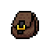
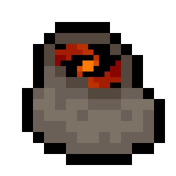
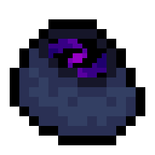
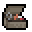

# About

This project is about solving the issue of inventory storage. 
In Necesse you have items that can hold specific items such as the Ammo Pouch, Lunchbox, and Potion Pouch. You also have a special type of storage option which is linked to your player: Void Pouch and Void Bag. The Void Pouch gives you access to 20 slots for your items and no matter which Void Pouch you open, you will have access to the same items. If you are familiar with Minecraft, this is very similiar to the ender chests. Though one big difference is that the Void Bag holds 40 slots but the first 20 are actually the same slots as the Void Pouch.
This mod adds new items that can each hold a set amount of items including items that will allow any item to be held. (Except other bags)

This mod is my solution to this problem and also my introductory learning process to Java programming.
Deadly990, my coauthor, has been teaching me the right way to do things and this project would not have gotten anywhere without his help.

# Translations

I would like to say that I am opening up the possibility for translations. If you would like to translate this mod you need to download the [en.lang](src/main/resources/locale/en.lang) file and translate the text after the equals sign.

Thank you for all your support and I am happy to be developing this mod for you.

# Items

| Item | Slot Count | Usage |
| --- | --- | --- |
| Small Bag | 10 | All items can be added. |
| Medium Bag | 20 | All items can be added. |
| Large Bag | 40 | All items can be added. |
| Extra Large Bag | 60 | All items can be added. |
| Deep Bag | 10 | All items can be added. Item stack limit within the bag is multiplied by 10x |
| Deeper Bag | 15 | All items can be added. Item stack limit within the bag is multiplied by 50x |
| Tacklebox | 10 | Only bait items can be added. Using bait from the bag is possible while fishing. |

# Recipes

Small Bag

  
  
  
  | Craft Location | Ingredients |
  | --- | --- |
  | Workstation | 5 Gold Bar, 10 Leather, 15 Wool |
  
  

Medium Bag

  
  
  
  | Craft Location | Ingredients |
  | --- | --- |
  | Demonic Workstation | 2 Small Bag, 15 Demonic Bar, 10 Wool |
  
  

Large Bag

  
  
  
  | Craft Location | Ingredients |
  | --- | --- |
  | Demonic Workstation | 2 Medium Bag, 10 Glacial Bar, 10 Ivy Bar |
  
  

Extra Large Bag

  
  
  
  | Craft Location | Ingredients |
  | --- | --- |
  | Advanced Workstation | 2 Large Bag, 10 Tungsten Bar, 10 Ancient Fossil Bar |
  
  

Deep Bag

  
  
  
  | Craft Location | Ingredients |
  | --- | --- |
  | Demonic Workstation | 4 Small Bag, 20 Void Shard, 15 Demonic Bar, 2 Void Pouch, 1 Dark Gem |
  
  

Deeper Bag

  
  
  
  | Craft Location | Ingredients |
  | --- | --- |
  | Demonic Workstation | 2 Deep Bag, 1 Extra Large Bag, 20 Tungsten Bar |
  
  

Tacklebox

  
  
  
  | Location | Cost |
  | --- | --- |
  | Bought from Angler | 1500-2000 Coins |
  
  

